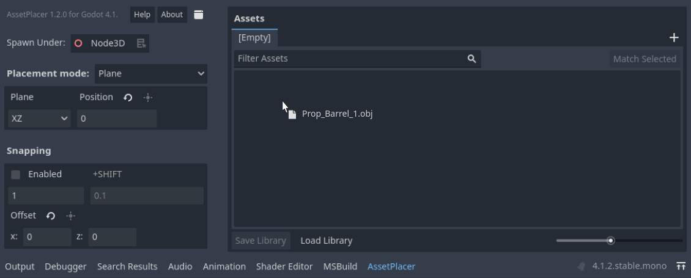
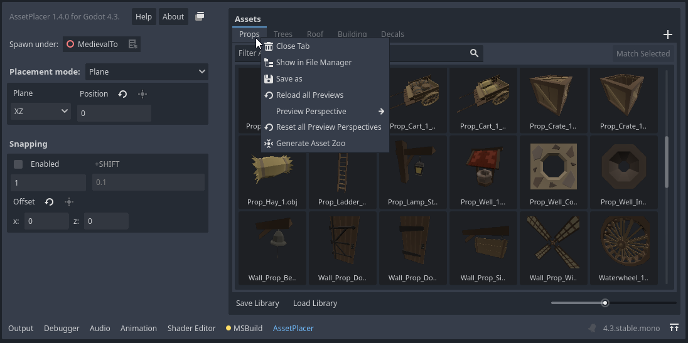
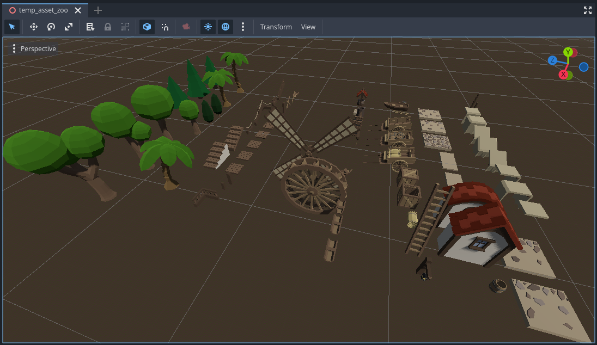
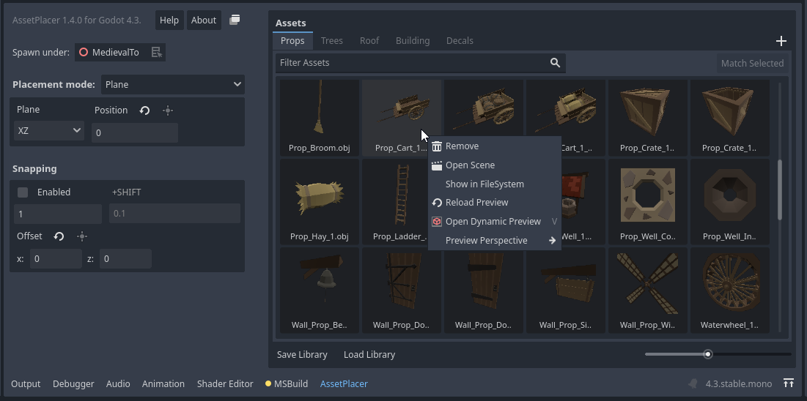
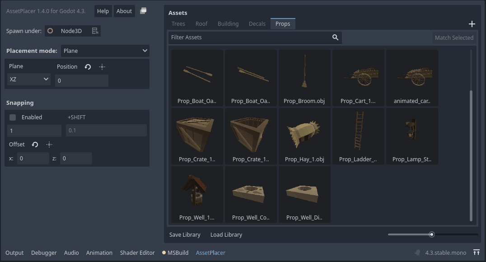
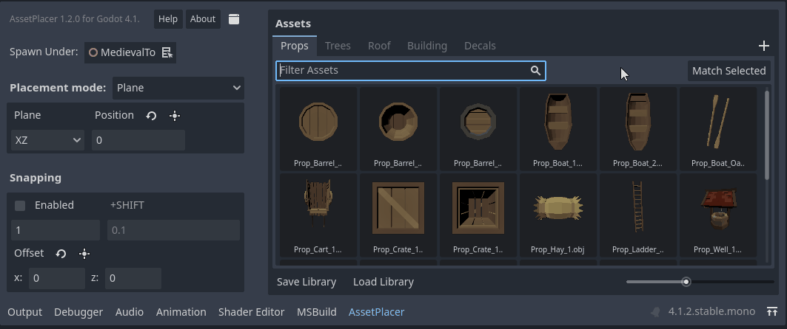
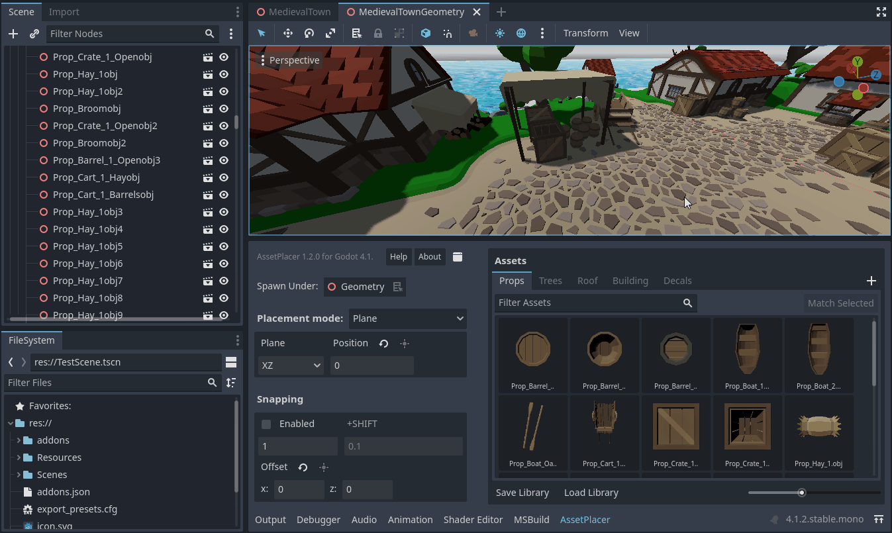
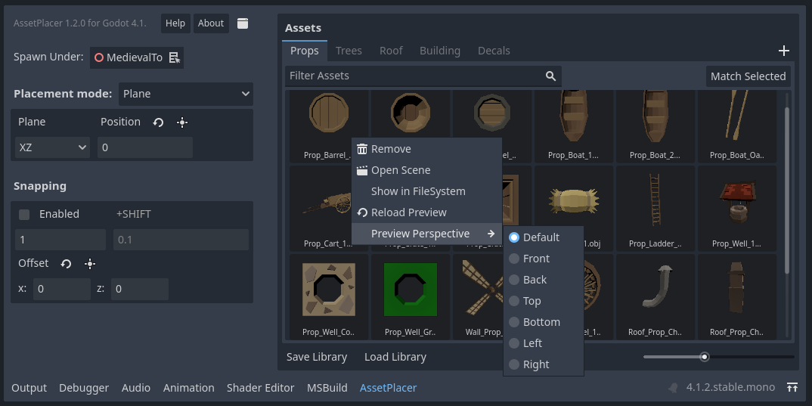
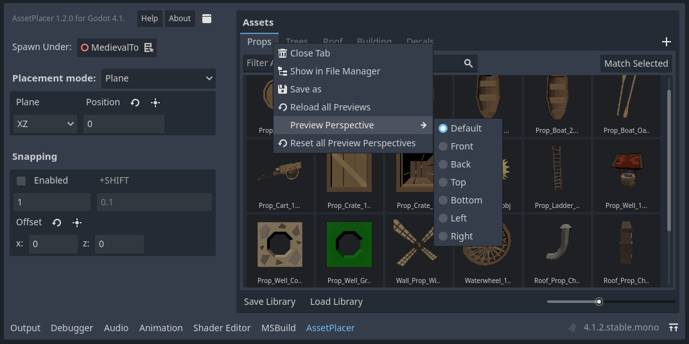

Asset Palette and Libraries
============================

The asset palette is the large panel on the right side of tthe AssetPlacer interface. This is where you manage your libraries and add and remove assets.
To add assets, simply drag and drop them into the panel. Note, that only 3D scenes (i.e. .tscn files with a root node that is/extends Node3D), 3D models (e.g. .obj, .gltf files) and meshes are supported, since other resources cannot usefully be placed in the 3D world.
The number of assets per library is unlimited. Yet, it is recommended to separate assets in libraries to make browsing more efficient.

If no library is open yet, a new one is created when you add the first asset. You can also create a new library by clicking the ``+`` button on the right side of the library tab bar. 
You can save the library by clicking on the ``Save Library`` button. Libraries are per default stored in the ``user:://`` directory. 
This has the advantage of not cluttering your project folder, but in return sharing your project folder does not include your libraries, so take this into account when making backups or using version control. 
Alternatively, you can configure where libraries are saved in the :doc:`Project Settings <settings/>`.
A saved library can be opened by clicking ``Load Library``. This opens the library in a new tab. If you want to close a library tab, simply click on it with the middle mouse button.
You can also right click a library tab to open the context menu, to either locate it in your file explorer, or to save a copy of it.

If you want to browse through all of your assets in 3D (for example to see how they relate in size), you can click on ``Generate Asset Zoo``. An asset zoo is a scene where all the assets of the library are placed, such that you can browse through them in 3D.
If you want to save the asset zoo, right click on the scene name and ``Save As``, as the zoo is only saved at a temporary location and will be overwritten.

If you want to remove an asset from a library, locate it in the FileSystem, or open it as a scene, you can right click it to open its context menu.

	
You can also click on ``Dynamic Preview``, or press :kbd:`V` while hovering over it to get a 3D preview of your asset. Rotate the asset with your middle mouse button and if you want to update the thumbnail from the new perspective, hit :kbd:`Space`.

Libraries keep only references to the assets you added. If you move assets around or delete them, their references might become invalid, and you need to add the asset again.
In case of unexpected behavior refer to the "Output" tab for information.

You can filter assets, by using the searchbar between the library tab and the assets.

In case you would like to place more instances of an asset that is already in the scene, you can select an instance of this asset in the scene, and then press the "Match Selected" button. 
This way, the matching asset will be selected in the current library, or in case that it is not present in the library, it will be selected.

Previews 
----------

The plugin automatically generates previews for your assets. It attempts to frame your asset as good as possible. However, you might want to change from which side your assets are being previewed. 
You can either choose to view them from the top, the front, the left, the right, the bottom, or the back. The default perspective can be configured in the :doc:`Project Settings <settings/>`. 
However, as you might want to choose differently for different assets, you can also choose the perspective per library in the right-click context menu of the tab bar, or by right clicking on an asset.
The preview setting on an asset overrides the preview setting of the library, which overrides the one set in the ProjectSettings.

The priority of the settings is such, that the setting on the asset overrides the library, and the library overrides what is configured in the project settings. 

There is also an option to reset the configuration on all assets of a library.
In case your asset changed in some way, you can click "Reload Preview" in the right-click context menu of on an asset, or "Reload all Previews" in the context menu of a library. 