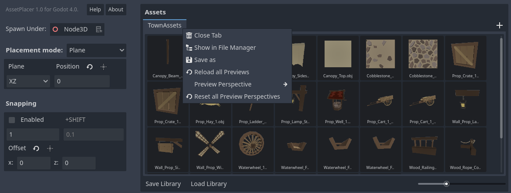

Asset Palette and Libraries
============================

The asset palette is large panel on the right side of tthe AssetPlacer interface. This is where you manage your libraries and add and remove assets.
To add assets, simply drag and drop them into the panel. Note, that only 3D scenes (i.e. .tscn files with a root node that is/extends Node3D) and 3D models (e.g. .obj, .gltf files) imported as scenes are supported, since other resources cannot usefully be placed in the 3D world.
The number of assets per library is unlimited. Yet, it is recommended to separate assets in libraries to make browsing more efficient.

If no library is open yet, a new one is created when you add the first asset. You can also create a new library by clicking the ``+`` button on the library tab bar. 
You can save the library by clicking on the ``Save Library`` button. Libraries are stored in the ``user:://`` directory. 
This has the advantage of not cluttering your project folder, but in return sharing your project folder does not include your libraries. Take this into account when making backups or using version control. 
A saved library can be opened by clicking ``Load Library``. This opens the library in a new tab. If you want to close a library tab, simply click on it with the middle mouse button.
You can also right click a library tab to open the context menu, to either locate it in your file explorer, or to save a copy of it.

If you want to remove an asset from a library, locate it in the FileSystem, or open it as a scene, you can right click it to open its context menu.

.. image:: images/AssetcontextMenu.png

Libraries keep only references to the assets you added. If you move assets around or delete them, their references might become invalid, and you need to add the asset again.
In case of unexpected behavior refer to the "Output" tab for information.
