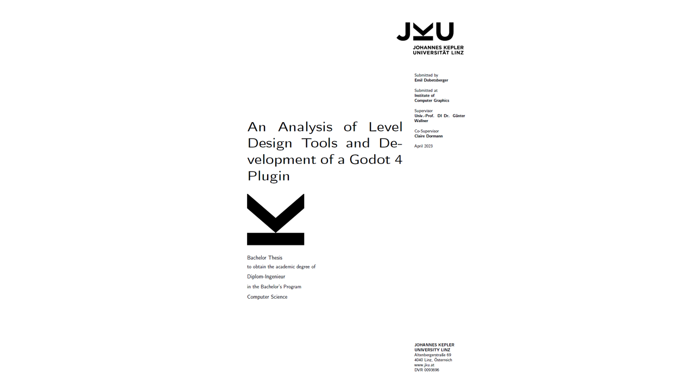

Demo
=============

An early version of this plugin is an artifact of my thesis "An Analysis of Level Design Tools and Development of a Godot 4 Plugin". In case you are interested in reading it, you can download it for free `here <https://drive.google.com/file/d/1mLH0y2ozTfkQ6tcTjn1u-QVynM5--yX6/view?usp=drive_link>`_. This version, with some minor updates and bugfixes, is freely available as a demo for you to download at https://github.com/CookieBadger/assetplacer-docs/releases/tag/Demo.

On how to install the plugin, see :doc:`Installation <installation/>`. As the demo is developed in C#, you need to use a Mono version of the Godot engine, and have `.NET <https://dotnet.microsoft.com/en-us/download/dotnet/6.0>`_ installed. Also, note that the plugin folder is called ``assetplacer_demo``, and its respective location ``res::/addons/assetplacer_demo``. 

Using the demo
-----------

You may use this demo for evaluating the AssetPlacer's functionality before committing to a purchase. If you do not intend to purchase the full version, you may also use the demo for non-commercial purposes, such as personal projects, or to complement reading of the academic thesis "An Analysis of Level Design Tools and Development of a Godot 4 Plugin". 

The demo will eventually release as open-source, but for now, please consider supporting my work by `purchasing the full version <https://cookiebadger.itch.io/assetplacer>`_ if you want to use in commercial projects.