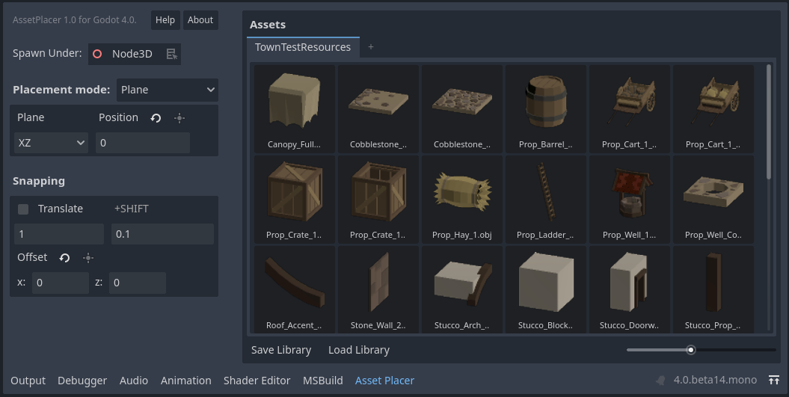

.. AssetPlacer documentation master file, created by
   sphinx-quickstart on Thu Mar 30 07:37:23 2023.
   You can adapt this file completely to your liking, but it should at least
   contain the root `toctree` directive.

Welcome to the AssetPlacer documentation!
=====================================================

The **AssetPlacer** is a plugin for the Godot game engine, that should help with level design by providing advanced asset browsing and placement tools.

Indices and tables
==================

* :ref:`genindex`
* :ref:`modindex`
* :ref:`search`

.. toctree::
   :maxdepth: 4
   :caption: Contents:
   
   quick_start
   manual
   faq