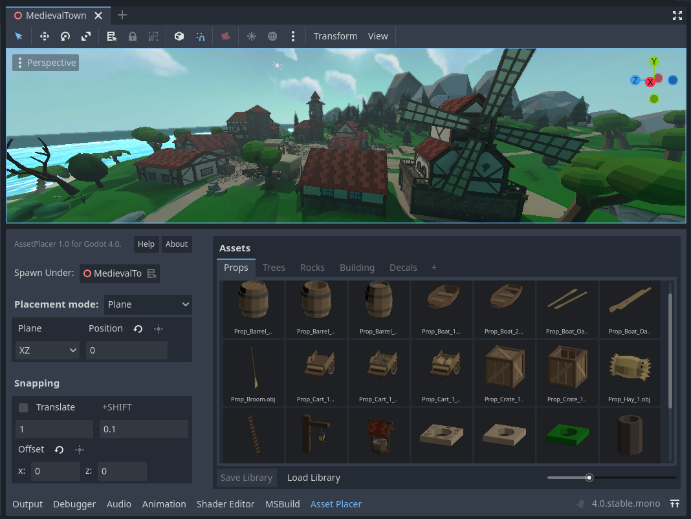
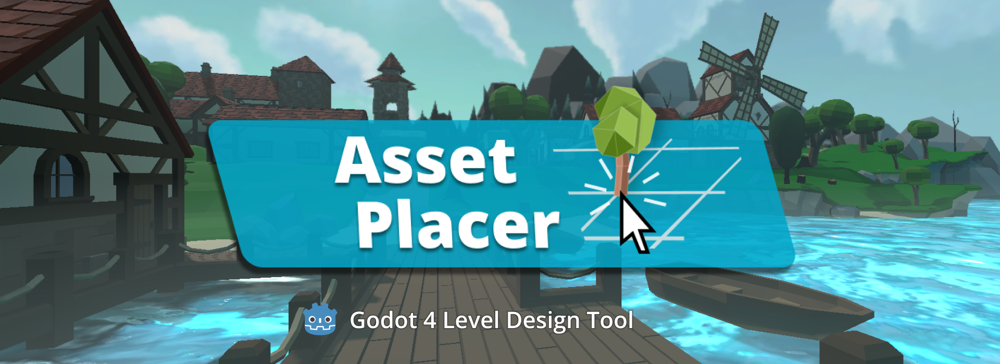

.. AssetPlacer documentation master file, created by
   sphinx-quickstart on Thu Mar 30 07:37:23 2023.
   You can adapt this file completely to your liking, but it should at least
   contain the root `toctree` directive.

Welcome to the AssetPlacer documentation!
=====================================================

The **AssetPlacer** is a plugin for the Godot game engine, that helps with level design by providing advanced asset browsing and placement tools.
Get it `here`_!

.. toctree::
   :hidden:
   :maxdepth: 4
   :caption: Quickstart

   installation
   usage

.. toctree::
   :hidden:
   :maxdepth: 4
   :caption: Manual

   interface
   adding_assets
   placing_assets
   placement_modes
   snapping
   painting_orienting
   settings
   
.. toctree::
   :hidden:
   :maxdepth: 4
   :caption: About
   
   faq
   license

Not only can you save massive amounts of time using the AssetPlacer, it also helps you achieve the same things with fewer actions, thus you can get more done with less strain. 
Do you want to see the plugin in action? Watch `this video <https://youtu.be/vkeYPDnk4DQ>`_, showing the creation of the scene above.

Click on any topics on the sidebar to find more information. If you want to quickly get started, read through the :doc:`Installation <installation/>` and :doc:`Usage <usage/>` pages. 

   .. If you want to see the asset placer in action, check out the following video: [Timelapse video]
   .. There are also tutorials on how to use it: [Tutorial]

|

.. _here: https://cookiebadger.itch.io/assetplacer