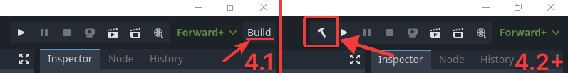

Installation
=============

The AssetPlacer is a paid plugin, therefore it is not available at Godot's built-in asset library. You can purchase the AssetPlacer plugin `here`_. 
Not all versions of Godot are supported by the plugin, so make sure you check that the plugin is compatible with the version you intend to use before you make your purchase. 
To install the plugin, follow the instructions below.

The AssetPlacer is developed in C#. Hence, to use it, you need to use a Mono version of the Godot engine, and have `.NET <https://dotnet.microsoft.com/en-us/download/dotnet/6.0>`_ installed.

1. Once purchased, retrieve and extract the downloadables. Make sure to choose the package that corresponds to your Godot version. 

2. Move the assetplacer folder into the addons folder of the Godot project, where you intend to use the plugin, such that the path to the plugin contents are ``res::/addons/assetplacer``. If the addons folder does not exist yet, create it. Note that it has to be called "addons".

.. image:: images/AssetPlacerFolder.png

3. In the top right corner of the editor, next to the play buttons, click the "Build" button. If you are using Godot 4.2 or later, this button is to the left and has a hammer icon. Otherwise it is a button to the right that reads "Build".

 
In case the button is not there, create a new C# script in your project and delete it again, and make sure you are using the Mono version of Godot.

4. Go to ``Project -> Project Settings -> Plugins`` and enable the AssetPlacer.

.. image:: images/ProjectSettings.png

5. On the bottom panel (next to Output, Animation, MSBuild, etc.), a new option "AssetPlacer" should have appeard. Click it, to open the AssetPlacer UI. 

.. image:: images/AssetPlacerBottomPanel_v2.png

Congratulations, you are ready to use the AssetPlacer!

.. _here: https://cookiebadger.itch.io/assetplacer