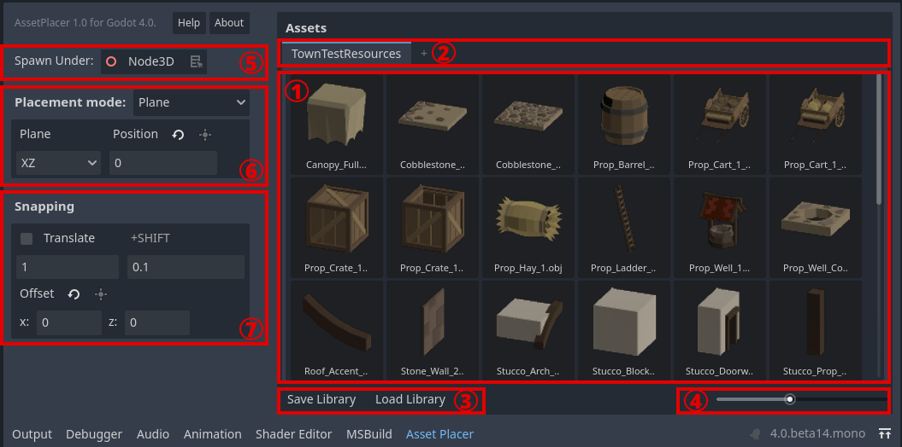

Interface
=========

The AssetPlacer UI consists of two major components. On the right, there is the asset palette, containing all currently selected assets.
On the left, there are the placement settings, to configure where assets should be placed in the scene tree and in the 3D world.
In the following image, parts of the UI are highlighted and enumerated:

1. The asset pallete. Drag 3D scenes, or 3D models that are imported as scenes, from the FileSystem to this panel, to add them to the current library. Select an asset by clicking on it to enable placement in the scene.
2. The library tab bar. Switch between different asset libraries or create a new library here.
3. Save the current library or load an existing library into a new tab.
4. Preview thumbnail size slider.
5. Spawn hierarchy selector. Defines under which node the assets are being placed. Defaults to the scene root. Drag and drop a node from the scene tree into the selector to mark it as the parent node for placing assets. Alternatively, click the button next to it, to mark the currently selected node.
6. Placement settings. Switch between plane placement mode and surface placement mode. Configure the plane, or alignment with surface normal. Contains a button to position the plane, such that the currently selected node is on the plane.
7. Snapping settings. Contains a checkbox for enabling and disabling snapping. Configure the size of the snapping grid, or the fine grid when holding down the Shift key. Offset the grid from the origin. Contains a button to offset the grid, such that the currently selected node is on the grid.