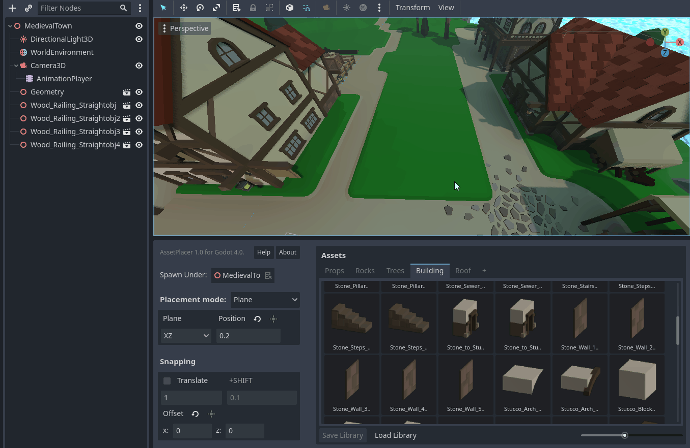
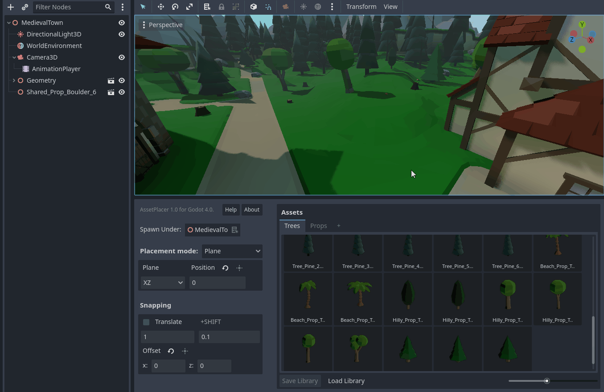

Painting and Orienting Assets
==============================

Depending on whether snapping is enabled or not, clicking and dragging offers different capabilities.

When snapping is enabled, you can paint assets, by clicking and dragging over all the grid positions you want to fill with assets. This will not place "duplicate" assets, when you cross the same position multiple times.
The same also applies to individual placement with snapping enabled. Note however, that different assets, will be placed at the same position.

When snapping is disabled, you can click and drag the mouse to the left or right, to rotate it along the normal of the plane or surface you are placing on. 
This helps to achieve some quick variety of orientation when scattering assets, or an organic look when placing objects that do not rely on precise orientation. Or you can just use it, to make things quickly face the correct way.

Notice that there is a small deadzone, where no rotation will be applied, to prevent accidental rotation of assets. 