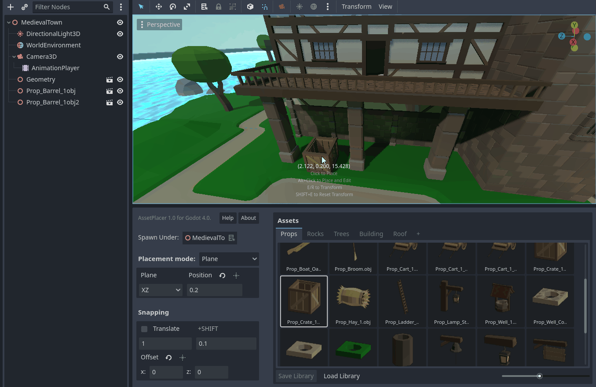

Placement Modes
================

At the moment, the AssetPlacer offers two different placement modes: Plane and Surface. You can switch the mode in the drop down on the left side of the user interface.

Plane Placement Mode
-----------------------

This is the default mode. The plane placement mode places assets - as the name suggests - on a plane, that can be configured by the user. This is mode is useful when the are you are working on is flat, blocky or when the differences in height are discrete.
When selecting an asset, and hovering over the viewport, the asset is positioned on the intersection of the plane and the line from the mouse position into the 3D world. 

With the "Plane" dropdown, you can switch between three different plane orientations. Or you can use shortcuts to switch between them.

* the YZ plane, which is normal to the X axis. Shortcut: :kbd:`Z`
* the XZ plane (default), which is normal to the Y axis - the "floor" plane. Shortcut: :kbd:`X`
* the XY plane, which is normal to the Z axis. Shortcut: :kbd:`C`

To position the plane along its normal, you can set the value in the input field next to the dropdown. E.g., if you use the XZ plane on a position of 5, you would be placing on the "floor" plane normal to the Y axis, positioned at y=5.
To avoid typing in values manually though, you can press :kbd:`G` to move the plane with the mouse. Click, when you are satisfied with the position, or press :kbd:`Esc` to cancel the displacement. 
:doc:`Snapping <snapping/>` also applies to the displacement of the plane, so you can use it to precisely move it to a certain height.
Whenever you make changes to the placement of the plane, it briefly shows up in the 3D view.

If you want to move the plane exactly to the position of an object in the scene, you can select it, and press the button above the position field, as shown in the image below.

Surface Placement Mode
-----------------------

The second mode offered by the plugin, allows to place assets on physics surfaces. This is useful when placing object on terrain, on walls, or when you need to place assets on a rotated plane.

.. image:: images/SurfacePlacementModeInterface.png

When selecting and asset, and hovering over the viewport, with this placement mode enabled, the asset is positioned on the intersection of the line from the mouse position into the 3D world and the first physics surface it intersects (raycast).
This only works on collision surfaces, so make sure that objects you want to place on, have a collision shape or collisions enabled (e.g. for CSG shapes).
You can also set a special collision mask for placement in the project settings under ``AssetPlacer -> Settings``.

.. image:: images/SurfacePlacement.gif

The surface placement mode also allows you to align assets with the normal of the surface they are being placed on. To enable this, make sure to check the box "Align to Surface Normal" and select the right direction of your object you want to align.
By default, this is the positive Y axis, which would work for e.g. placing trees, but when you want to stick a sign to a wall, you might, for example, use the X axis instead.

.. image:: images/SurfacePlacementAligned.gif