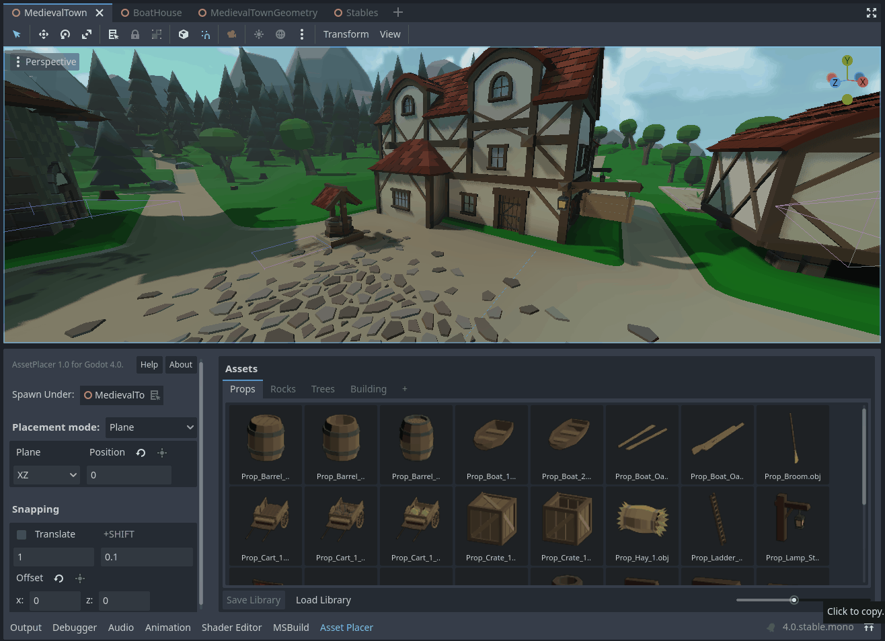
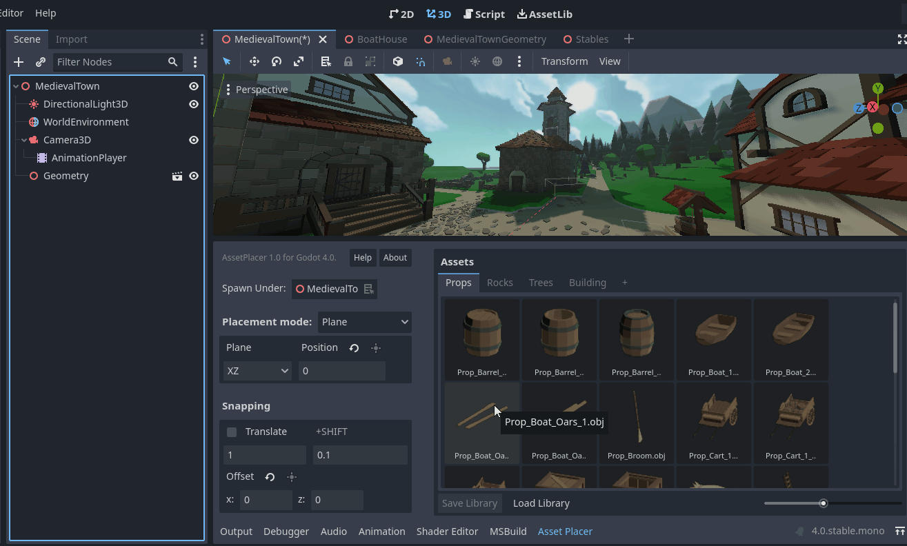
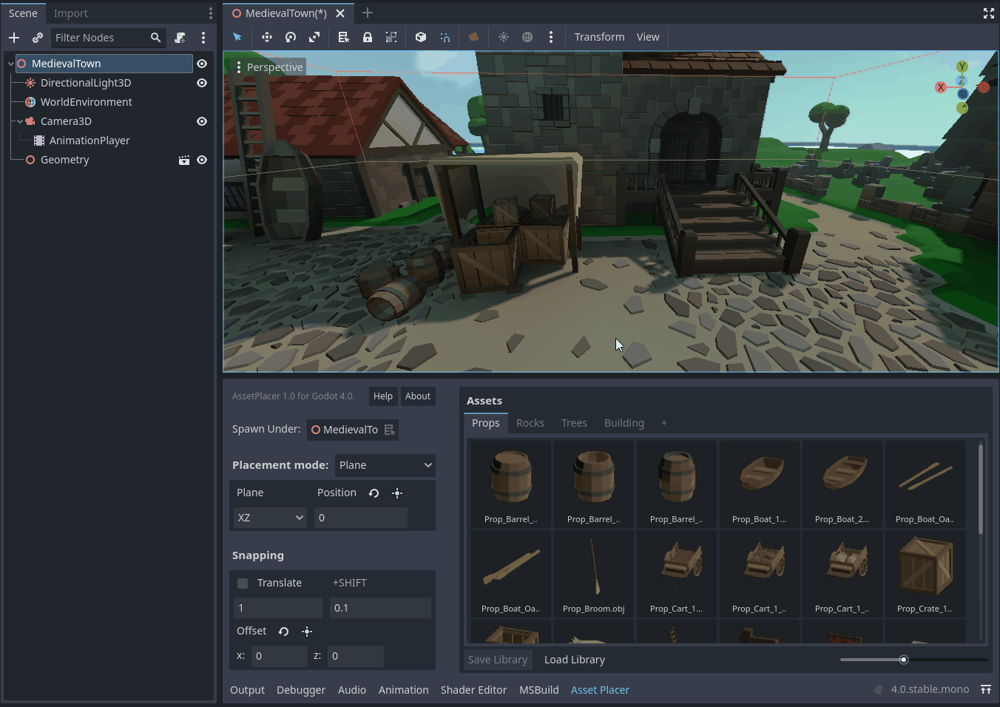
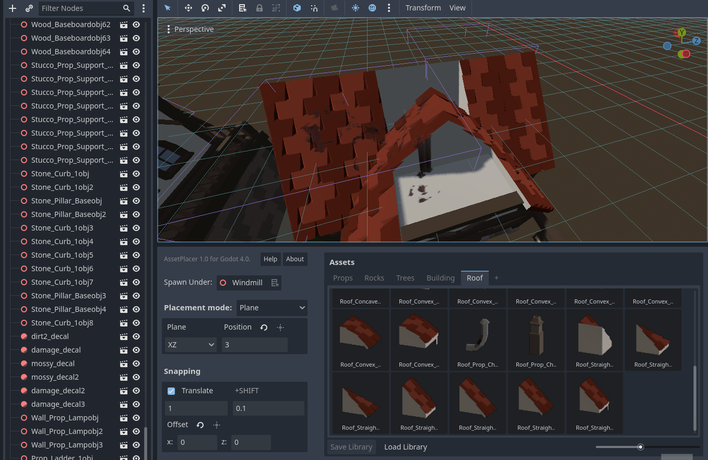

Placing Assets
===============

The heart of this plugin is the feature to place assets in the 3D environment. Once you have :doc:`added assets to a library <adding_assets/>`, you can place instances of them in a 3D scne.
To do so, click on an asset in the asset palette. It becomes highlighted and once you now hover the mouse over the 3D world, you should see a preview of your asset under the mouse cursor (to explore the capabilities of the plugin with the default settings, make sure you position the viewport camera above the origin, looking slightly downwards). 

You can now click to place instances of your assets. They are being added to the scene tree under the selected spawn parent. 
You can change the spawn parent in the AssetPlacer UI, by dragging a node from the scene tree onto the "Spawn Under" field, or by selecting a node and then clicking the button next to "Spawn Under".

    
As placing assets does not flag the scene as changed, **make sure to always save your scene** after you placed assets, even though the editor does not remind you to!

You can keep placing more instances of your selected asset or select a different asset from the palette. If you want to stop placing assets, press :kbd:`Esc` to deselect the asset. 
In case you then want to select the same asset again, you can press the :kbd:`Space`, to select the last asset again.
If you want to place an asset and select it, to apply some transformations or modifications to the instance, you can use :kbd:`Alt+Click`.

If you want to transform not just the current instance of the asset you are placing, but all instances you are placing, you can select the asset and press :kbd:`E` to rotate or :kbd:`R` to scale, while hovering over the viewport.
You can apply the desired changes and then press :kbd:`Space` to confirm. In case you want to cancel your changes, press :kbd:`Esc`. Notice that transformations persist when you deselect and select your asset again.
If you want to reset the transformation of your asset entirely, press :kbd:`Shift+E`.

You can also apply some quick transformations by using shortcuts. With :kbd:`A`, :kbd:`S`, and :kbd:`D` you can rotate your asset by 90 degrees on the X, Y, and Z axes. 
Using the :kbd:`Shift` modifier, the rotation step is halfed to 45 degrees. You can also change the amount of rotation when holding :kbd:`Shift` in the ProjectSettings under ``AssetPlacer -> Settings``. 
You can also flip your asset by inverting scale components along the X, Y and Z axes by using the keys :kbd:`1`, :kbd:`2`, and :kbd:`3`.

..
    only if gif can also show keys
..

Of course, the plugin would be very limited, if you could only place on the XZ plane. You can change the plane you are placing on, or place on physics surfaces instead. Refer to :doc:`placement_modes` for more information.

Finally, you can also use :doc:`snapping </snapping>` to place your assets at an exact position, regular distances, and in grid patterns. 
By clicking and dragging while snapping is enabled, you can paint assets in a line, and  when snapping is disabled you can rotate the asset normal to the up vector of the plane you are placing on. Refer to :doc:`painting_orienting` for details.
