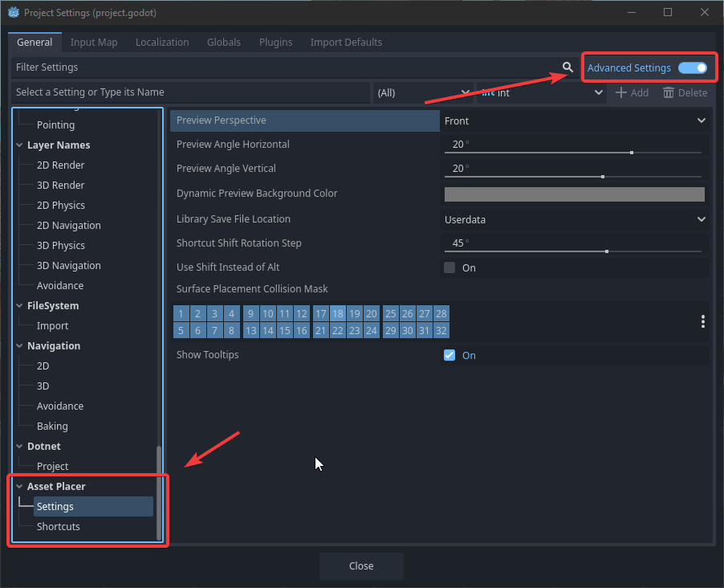

Settings and Configuration
=============================

As described in various other locations, you can change certain aspects of the plugin in the project settings. These settings are saved in your ``project.godot`` file.
You can access them by going to ``Project -> ProjectSettings...``, and then scrolling down to the ``Asset Placer`` section. 
Make sure, that ``Advanced Settings`` is enabled, otherwise the section will not show up.

Here is everything you can configure. The order of the settings might occasionally change.

#. Shortcuts: All shortcuts that the plugin uses can be configured here, by modifying the respective InputEventKeys. You can also add additional alternatives to achieve the same thing.
#. Use Shift Instead of Alt: in case you have troubles due to some different mapping of your Alt key, you can check this to use Shift+Click to place and select assets.
#. Show Tooltips: I understand that the tooltips might be annoying and clutter your scren, so here you can turn them off entirely!
#. Preview Perspective: The default perspective from which previews are rendered, if nothing else is configured for the library or the asset.
#. Library Save File Location: If you want your libraries to be saved in your project folder, you can configure that here!
#. Shortcut Shift Rotation step: When you press a *secondary step* rotation shortcut, it will not rotate the asset by 90 degrees, but by this amount. Change it to your needs.