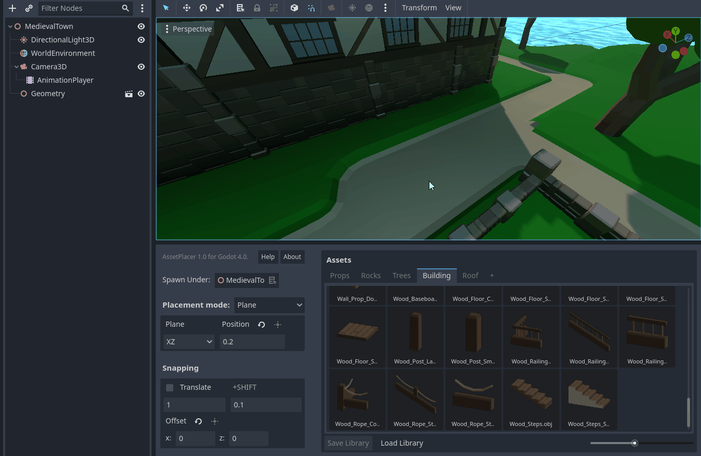
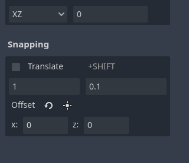
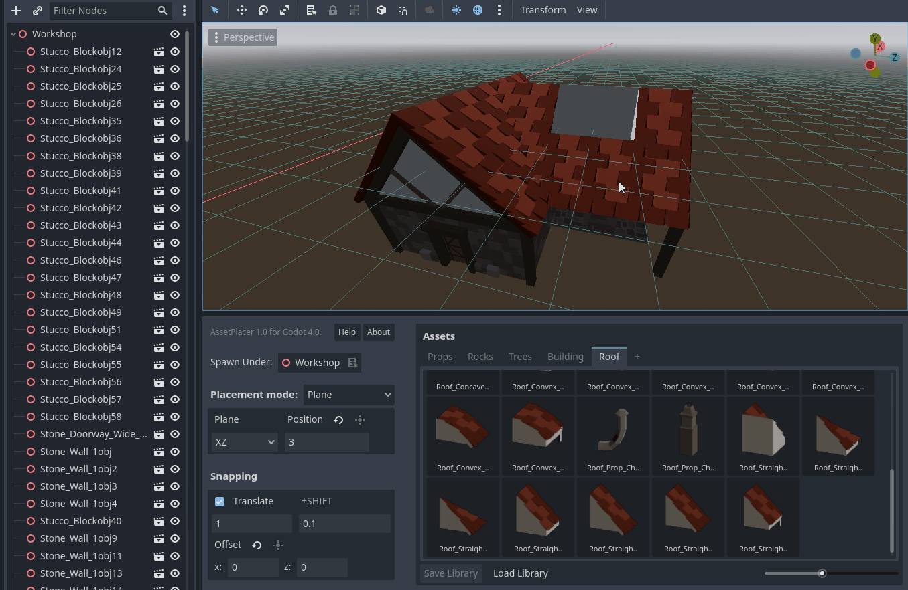

Snapping
=========

To make the use of modular assets and placing objects at regular distances easy, the AssetPlacer offers Snapping capabilities. Compared to the Godot editor's built-in incremental snapping applied to transformations, the AssetPlacer offers GridSnapping, i.e. assets are snapped to absolute positions on a global grid. 
Note that the AssetPlacer's snapping is separate from Godot's internal snapping, thus you need to make sure to configure both of them to fit your needs. 
There is a checkbox in the AssetPlacer's user interface, that enables snapping. For convenience and consistency, you can also toggle snapping when placing assets by holding down the :kbd:`Ctrl` key.
When snapping is active, a grid is displayed on the plane that assets are currently being placed on.

You can configure the size of the snapping grid in the user interface. The grid updates, whenever you change the snapping settings. The first value indicates the normal snap step, the second value configures the size of the snapping grid, when holding down :kbd:`Shift`.
This value defaults to 10% of the normal snap step, whenever you change the normal step, but you can set any number you need, even numbers larger than the normal snap step, to fit your use case.

To be able to use the grid with any layout of your level, there is an additional setting to offset the grid. This setting allows, to displace the grid along the plane by any values smaller than the snap step.
This is especially useful, when you want to build e.g. a wall at an irregular position, but want all individual pieces of the wall to be snapped together.
To be able to quickly use this feauture without typing values, you can select an object in the scene, that you would like to be on the grid, and press the button to displace the grid accordingly.

The plugin will avoid placing the same asset twice at the same position if snapping is enabled. However, this feature only works for the last couple of hundred assets placed, so be careful when working on large scenes! 

