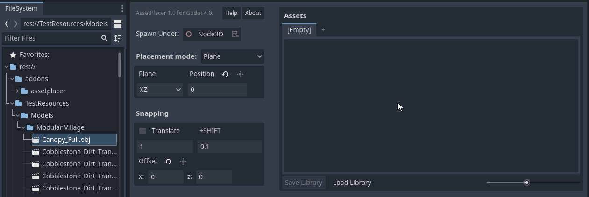
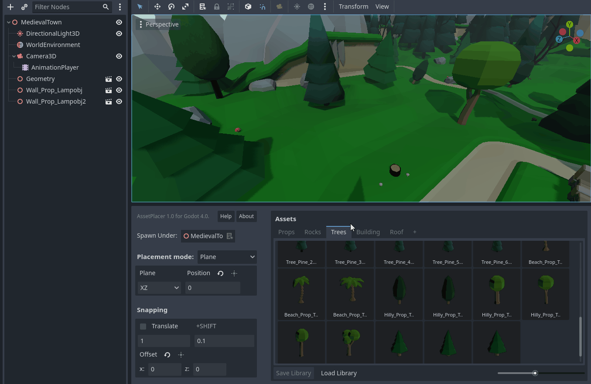
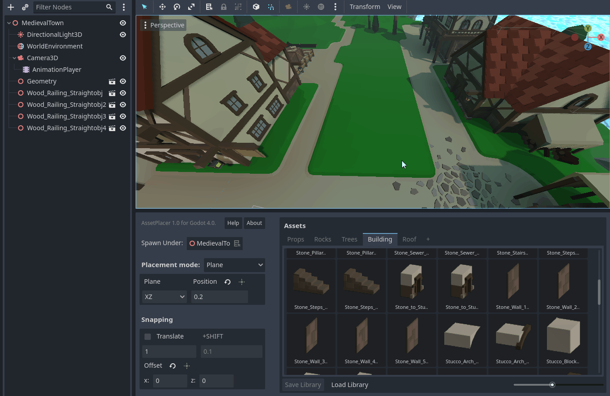
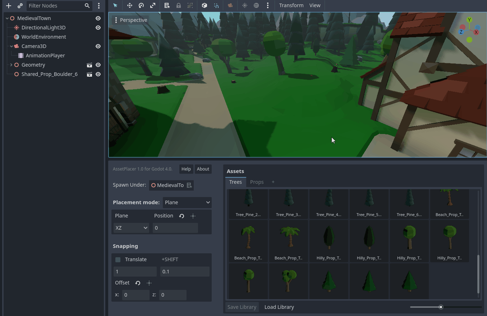

Usage
======

The AssetPlacer helps to quickly browse through a selection of 3D assets and place instances quickly and efficiently in the scene.
This section, will briefly explain how to use the plugin. For a more in-depth description of each feature, please refer to :doc:`manual`.

Interface
-------------------------

.. image:: images/InterfaceLayoutCoarse.png

The AssetPlacer UI consists of two major components. On the right, we have the asset palette (1), it displays all the assets that are currently in the library with previews. Clicking on an asset selects it for placement.
On the left, we have the placement settings (2). Here you can configure how assets should be placed (on a plane, or on surfaces) and whether grid-snapping should be applied, as well the specific configuration of the snapping grid.

Adding and Placing Assets
--------------------------

You can add any 3D scene or any 3D model, that is imported as a 3D scene to the asset placer, by dragging and dropping it from the FileSystem to the asset palette as shown below.

The asset then gets added to the palette and a preview should be shown. 
In case of any error, check if there is anything in the Output panel of the Godot engine. 
You can add as many assets as you want to the palette. Optionally, you can also click "Save Library", to store your selection of assets and be able to load it up after you restart the editor.
Right click on an asset in the asset panel to open the context menu, e.g. to remove it from the library. Remember to save the library again after you make any changes.

To the left of the asset palette, you can then configure how you want to place assets. For example, you can select to place them under the root node and on the XZ plane at a height of 0, which is the default setting.
To place an asset, click on it in the asset palette and move the mouse over the 3D viewport. A preview of the asset should follow your mouse cursor in the 3D scene. To place it, simply click once. To deslect the asset, press :kbd:`Esc`.

.. image:: images/PlacingAsset.gif

As placing assets does not flag the scene as changed, **make sure to always save your scene** after you placed assets, even though the editor does not remind you to!

You can toggle snapping by holding down the :kbd:`Ctrl` key, while placing the asset. If you want to immediately select the asset when placing the asset, hold the :kbd:`Alt` key while clicking. This helps to quickly perform some unique transformations to the instance. 
If you want to transform the preview and all subsequently placed instances of the asset, by rotating or scaling, press :kbd:`E` or :kbd:`R` respectively. If you are done, press the :kbd:`Space` key. If you have no asset selected, you can press :kbd:`Space` to select the most recent asset.

In order to not rely on manually typing the position values all the time, you can press the key :kbd:`G` and then move the mouse to displace the placement plane. Snapping settings apply to the plane displacement. 
Left click, once you are satisfied with the position. Of course, this feature only exists in the plane placement mode.

.. image:: images/PlaneDisplacement.gif

You can also place assets on physics surfaces. Make sure, that collisions are enabled on the surface objects you want to place assets on (e.g. the terrain). 
You can also press a checkbox in the placement configuration, to align your asset with the normal vector of the surface you are placing on.

If snapping is enabled, you can paint a row of assets by clicking and dragging. If you draw over your line of assets, assets will not be stacked at the overlaps.

If snapping is disabled, you can click and drag to rotate your asset along the normal vector of the surface you are placing on.

With these instructions, you should be ready to use the AssetPlacer for the creation of your levels. However, it is recommended to take some time to look at the table of shortcuts below, to get the most out of the plugin.

Shortcuts
-----------
Here is a list of all the shortcuts in the plugin. The most frequent actions are highlighted in bold, so the us of these shorcuts is especially recommended.

.. list-table::
   :widths: 65 35
   :header-rows: 1

   * - Action
     - Keybinding
   * - **Rotate mode**
     - :kbd:`E`
   * - **Scale mode**
     - :kbd:`R`
   * - **Reset transformation**
     - :kbd:`Shift+E`
   * - **Confirm asset transformation** (in transform mode)
     - :kbd:`Space`
   * - **Select last asset** (when none selected)
     - :kbd:`Space`
   * - **Place and select**
     - :kbd:`Alt+Click`
   * - **Toggle snapping**
     - :kbd:`Ctrl`
   * - **Displace plane** (in plane placement mode)
     - :kbd:`G`
   * - Rotate 90 degrees around X
     - :kbd:`A`
   * - **Rotate 90 degrees around Y**
     - :kbd:`S`
   * - Rotate 90 degrees around Z
     - :kbd:`D`
   * - Rotate 45 degrees around X
     - :kbd:`Shift+A`
   * - Rotate 45 degrees around Y
     - :kbd:`Shift+S`
   * - Rotate 45 degrees around Z
     - :kbd:`Shift+D`
   * - Flip on X axis
     - :kbd:`1`
   * - Flip on Y axis
     - :kbd:`2`
   * - Flip on Z axis
     - :kbd:`3`

These are the default keybindings recommended by us, but you can change any of them in the Project Settings under ``AssetPlacer -> Shortcuts``.
